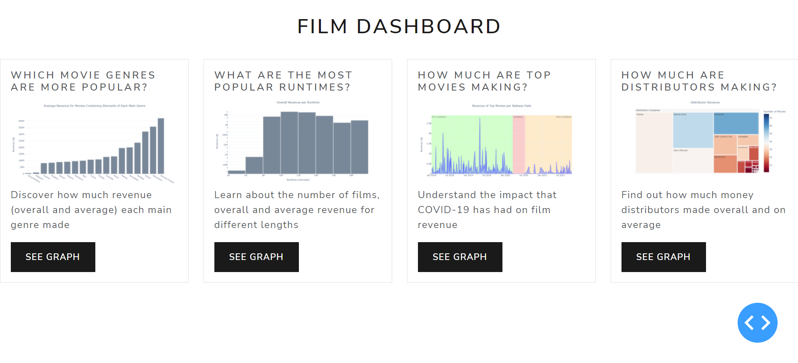

# COMP0034 COURSEWORK 1
## GitHub Repository URL
Here is the [link to my repository](https://github.com/ucl-comp0035/comp0034-cw1-i-PDA44719.git).

## Visualization Design
For the visualization design, the [prepared dataset](prepared_dataset.xlsx) and [persona](persona.png) from COMP0035
have been taken into account. Please refer to the [markdown document](visualization_design.md) used to explain the
visualizations.

## Dash App

### Background Information
Before looking at the python files that contain the dash app, it is important to have some background information.
My app has two different kinds of pages: the main page and the specific graph page. Within the main page, you will see
a dashboard containing 4 different cards.



Once you press the SEE GRAPH button, you will be redirected to the specific graph page. Each graph will present the user
with different visualization options (either through a dropdown bar or a checklist) that will modify the charts that are
being shown.

When looking at the code, there is a distinction between a graph and a figure. There are four graphs (the ones
appearing on the main page), each of which is comprised of one or multiple figures. Depending on the visualization
option that the user has selected, a different figure will be displayed.

### Going Beyond the Teaching Material
There are numerous things that I have done to go beyond the teaching material. Firstly, I have created a class to create
the charts, and I have looked into privacy and encapsulation [A]. As I do not want users to be able to modify my charts
and use them to potentially misinform other users, I have made all the attributes and methods private. Then, I have
created some getter methods [B] that allow users to access the charts, but they are not allowed to modify them.

Apart from that, through a combination of defining the width and height of elements like graphs in my dashboard, I am
allowing users with different screen sizes to be able to visualize the graphs properly (for this, I have looked into
viewport units [C], which are defined as 'vh' within my code).

Furthermore, I have created charts that are more advanced than the ones shown in our lectures (e.g., I have created a
treemap with a color scale, bar charts with error bars), I have created multiple callbacks that allow for a high
level of interaction with the app and the app contains multiple pages.

### App Files
There are two main files that are utilized. The file that contains the [ChartCreator](chart_creator_module.py) class and
the file that contains the [dash app](dash_app.py).

Additionally, there are some images on the [assets](assets) directory which are used both for the app and for the
explanations.

## Software Engineering Tools
- GitHub has been used consistently through the use of commits to guarantee source code control.
- All the requirements are specified in the [requirements file](requirements.txt). They are installed through the use of
the ```pip install ...``` command.
- Weekly Status Reports have been submitted to ensure I kept track of my progress. I will copy-paste them below from
moodle.

#### Week 1
What did you do this week?

- I have accepted the coursework 1 assignment on GitHub.
- I have uploaded the persona, questions and prepared dataset from comp0035.
- I have created some graphs for answering the first question (I am using a jupyter notebook for explaining and showing
the visualizations).

What will you do next week?

- I will answer other questions (at least a couple more of them).
- I will learn about html, css and dash.
- I will start developing the dash app.

Any issues blocking progress? State the issues if so.
- There have been no issues so far.

#### Week 2
What did you do this week?

- I have researched about the basics of hmtl, css and dash.
- I have created the first version of the dashboard. So far, I have a main page (which has cards containing an image of
each of the graphs and a button to travel to the secondary page) and a graph page (the secondary page, which contains
the figure in full size and allows the user to interact with it. It also has a button to navigate back to the main
page). A callback function has been created to make navigation possible. At the moment, only one graph has been included
(all the cards contain the same graph).

What will you do next week?

- I will watch the lectures about Plotly Express and Plotly Go.
- I will include the rest of the graphs that I have, and I will continue to create more graphs to answer some of the
other questions.
- I will include a higher level of interaction with the user (e.g., allowing the user to change the axes).

Any issues blocking progress? State the issues if so.

- I underestimated how much time was going to be necessary to create the dashboard. Hence, I have not had time to create
more graphs.

#### Week 3
What did you do this week?

- I have included dropdown bar and a couple of callbacks (change_y_axis) which allows the users to change the y-axis of
the charts.
- I have included three extra charts (histograms) and I have created a couple more (in the jupyter notebook).
- I have created a couple of functions: (create_card and create_graph_page_with_dropdown), which will avoid having to
repeat the code to create the dashboard.

What will you do next week?

- I will finish the creation of my graphs and I will include all of them in my dashboard.
- I will start elaborating a document for the visualization design (so far, I have thought about which types of charts
should be utilized for answering each question, but I have not typed it down).
- I will watch this week's lectures and try to find more ways to increase the interactivity of my app.

Any issues blocking progress? State the issues if so.

- I have had no issues this week.

#### Week 4
What did you do this week?

- I have created all my graphs and have added them to the dashboard.
- I have created visualization_design.md (document in which I have included explanations about the design of my graphs.

What will you do next week?

- I will finish visualization_design.md (so far, only the three first graphs have been explained).
- I will add more interaction to my graphs.
- I will watch the lecture videos about testing and may create some tests for my dashboard (if I have enough time).

Any issues blocking progress? State the issues if so.

- There have been no issues so far.

#### Week 5
What did you do this week?

- I have finished the dashboard app (i.e., included all the interaction that I had planned).
- I have started including docstrings and reorganizing the code.
- I have added more information in visualization_design.md.

What will you do next week?

- I will finish with the docstrings and code reorganization.
- I will finish visualization_design.md.
- I will finalize the project (i.e., updating the requirements, including some information on README.md, reviewing the
code and the dashboard) and submit it.

Any issues blocking progress? State the issues if so.

- There have been no issues so far.

## References
[A] @nikhilaggarwal3. (2019, November 26). Private Methods in Python. GeeksforGeeks. Retrieved February 10, 2022, from
https://www.geeksforgeeks.org/private-methods-in-python/ 

[B] Verma, A. (2019, December 4). Getter and Setter in Python. GeeksforGeeks. Retrieved February 10, 2022, from
https://www.geeksforgeeks.org/getter-and-setter-in-python/ 

[C] Suzanne, M. (2017, June 13). Fun with viewport units: CSS-tricks. CSS-Tricks. Retrieved February 14, 2022, from
https://css-tricks.com/fun-viewport-units/ 

