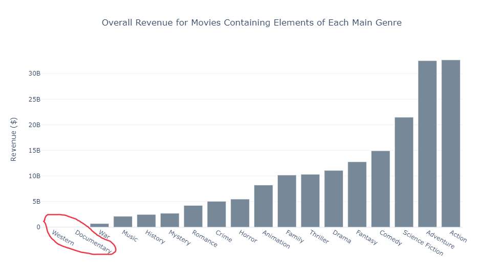
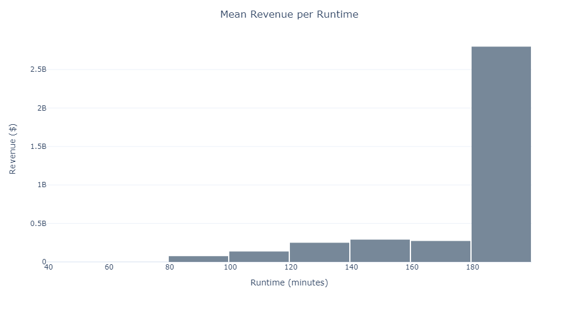
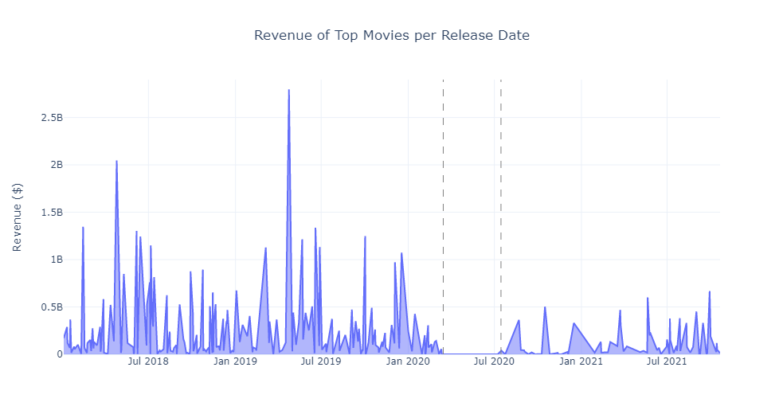
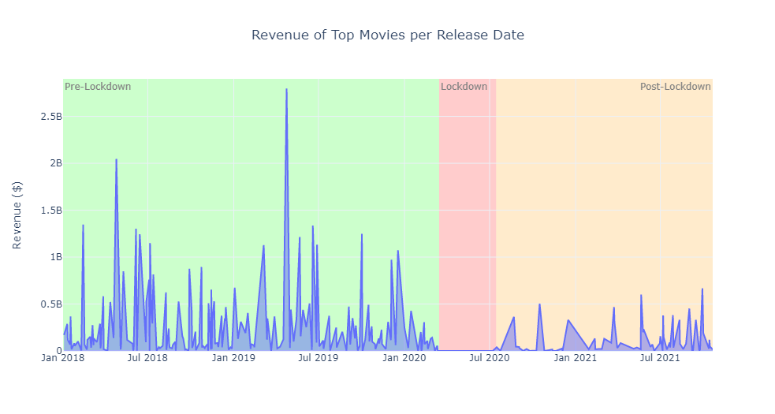
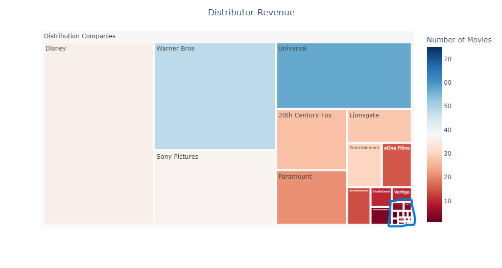

## Visualization Design

**Before you read**: There are sources like [1] which discuss the importance of avoiding "chartjunk". Unless otherwise
specified, no background colors, legends, or distracting colors (i.e., grey has mostly been used) were utilized.

### Graph 1
The first question that will be addressed is the following: **Which movie genres are more popular (i.e., with respect to
the revenue)?**. To answer this question, the **Genres** column will be used. I will be adding the revenue of movies
that contain a specific genre (for each of the genres), and then I will compute the average.

#### Type of chart
For selecting chart types, a resource that I used is [2], which provides a detailed guide. The 4th
question discussed in the article (**"What is your data type?"** [2]), it is stated that: *"if you have categorical
data, then using a bar chart or a pie chart may be a good idea"* [2]. As movie genres are *categorical* data, it would
make sense to use one of the two different types. I will not be using a pie chart, however, because movies can have more
than one genre. Hence, the percentages displayed on that chart would be misleading.

Another aspect that must be considered is the fact that not all movies have been considered: there are movies that came
out after the creation of the dataset and others that were released before 2018 that have not been included. Hence, we
want to know the accuracy of our calculations when it comes to predicting revenues of the overall movies (not just the
sample of movies utilized for the figures). For that matter, bars will be included representing the standard error of
each genre. [3] gives a good explanation about the standard error, with a very good example about the average age of
people that are diagnosed with Alzheimer's (furthermore, it also includes details about how to calculate it).

#### Visual Aspects
The main issue with this graph is that it could be deceitful should it not be titled properly. In [4], the five
qualities of great visualizations are explored. One of them is truthfulness, for which the designer must ask: *if
anything is being obscured*. If the title was named: **Genre Revenue per Movie**, there
would be some information omitted: movies usually have more than one genre (i.e., some movies with multiple genres are
being considered to calculate the average revenue of *each* of those genres). Therefore, we need a title that makes this
clear.

The title that was considered best is: **Average Revenue for Movies Containing
Elements of Each Main Genre**. *Containing Elements of* indicates that movies can have elements that are not limited to
just one genre. Furthermore, the addition
of the word *Main* indicates the existence of other genres that may not have been considered in our graph.
[5], which discusses *"chartjunk"*, displays an animation in which it is shown that the *labels must be simplified* to
avoid redundancy. While this title may not be considered "simple", *I believe that choosing to avoid potentially deceiving
users, even if that requires a longer and more complex title, was the proper way to go for my chart*.

This graph is aimed at **film producers**, each of whom will have a set of preferred genres (i.e., in a complete version
of my app, users would select their preferred genres when registering). Therefore, it would be ideal
if users could have the option to highlight their own preferred genres so that they can have an easier time to visually
understand how potentially profitable each of them can be.

#### Visualization Evaluation
The question that was asked is which movie genres are more popular. Therefore, after creating the chart, I realized
that there was a problem with *only considering the mean*: genres who appear on a high number of movies and others who are
rarer might not appear to be too different when it comes to popularity (i.e., if they have a similar average).
Hence, I decided to also create a chart displaying the overall revenue of the genres. This chart will have a similar
style to the previous one. The combination of both graphs will provide a *bigger picture*.

After seeing both charts, I realized that there is an issue with the two less profitable genres: Documentary and
Western. These make considerably less money than the others. Hence, it is difficult to
see their revenue (especially in the overall revenue chart).

A potential way to solve
this would be to utilize a logarithmic scale on the y-axis. This, however, makes comparisons between different genres
more difficult to grasp visually (due to the non-linearity of the axis). Hence, it was decided that a linear axis would
be better. Another potential way to solve the issue would be to not include those two genres in the chart, stating that
they were excluded due to them not meeting a minimum amount required (for instance).

### Graph 2
The question to be addressed with this graph is: **What are the most popular runtimes and how much money do they make?**
To answer this question, the Runtime column from the dataset will be utilized. No further processing will be necessary
to create the graph.

#### Type of chart
This time, the data is *continuous*, which rules out bar or pie charts. A useful question that I asked myself is:
**"What's the story your data is trying to deliver?"** [2]. The purpose of this question is not finding a trend (for which a
scatter plot or a line graph could have been utilized), but showing a distribution. The search by function tab on [3], shows the different
kinds of graphs that can show the distribution of the data (e.g., density plot, box & whisker plot). I will be utilizing
a **histogram** because that is the type that I am *more familiar with*.

#### Visual aspects
Once again, it must be considered that the revenue can be computed as the *overall* revenue or the
*mean*. Therefore, two different plots will be created. The titles that will be utilized for the figures are **Overall
Revenue per Runtime** and **Mean Revenue per Runtime**. These titles are kept *simple and to the point*.

The movie runtimes range from *40 to 200 minutes*. Hence, there are 160 minutes displayed in the x-axis. We can create
bins that have groups of **20-minute ranges**. Which means that 8 total bins would be used. Furthermore, the y-axis
will be kept linear because it is easier to compare the different ranges this way.

Additionally, I want users to be able to see the *number of movies* that each bin contains, so that they can have an
understanding of how common those runtimes are (which will also help to answer the first part of the question: what are
the most popular runtimes). Knowing the number of movies that fit into each bin is *paramount* for film producers,
as they want to keep track of the *current runtime trends* so that they can decide the best length for their upcoming
films. Hence, I will include the number of movies that are part of each range as a *hover value*. Lastly, I will be
adding some **separation between the bars**, so that users can distinguish them easier. 

#### Visualization Evaluation
Even though it was initially intended to utilize *linear y-axis*, it was decided not to use it because for both the
overall and mean revenue histograms, there were some bins that had a significantly higher revenue than the rest,
which made it challenging to appreciate the differences between the runtimes. Hence, a **logarithmic scale** was
utilized in the end. Find below a picture of what the *Mean Revenue per Runtime* chart would have looked like with a
linear y-axis.

The second problem that was encountered is that including the number of movies in each bin as part of the hover value
is not simple. [6] was analyzed to try to find a way to do this, but is does not seem to be possible using
*go.Histogram()*. Therefore, I had to choose between using a histogram without including the count, or using a barchart
to include it (due to the fact that I am already familiar with how to do that in a bar chart). In the end, I decided to
stick with *histograms* (because bar charts had already been used) and *creating a third chart* that showed the counts.
This last chart will have a similar style to the previous ones, but the *y-axis will be linear* because the number of
movies is not high enough to require a logarithmic scale.

A potential way to improve this graph is to take into account the *runtime of the movies created by the user* and
display that information in the chart. For instance, the *mean* runtime could be calculated and the bin where that
average lies could be *coloured differently*; or the names of each movie made by the producer could be included as text
inside the runtime bin they correspond to. This would allow users to have a *deeper understanding of their own
filmography*.

### Graph 3
The question that will be answered with this graph is: **How much are top movies making now compared to before and during
the first COVID-19 lockdown?** We will be using the **Release Date** column of the dataset. *All the release dates* will
be inserted into a list and the *sum of revenues* of films that came out on each of those release dates will be inserted
into a different list. Then, both lists will be utilized to plot the chart (if you tried to plot the graph using a
pandas dataframe directly, the revenue of movies that came out the same date would not be added).

#### Type of chart
The purpose of this chart is to *display information over time*. [7] shows that bubble charts, heatmaps, line and area
charts, etc. can be utilized in this case. Another important detail is that we are *trying to find a trend* (i.e., by
comparing values from 3 different time periods). Hence, an **area chart** will be used, because "Area charts are perfect
when communicating the overall trend, as opposed to the individual values" [8].

#### Visual aspects
As *three different time periods* will be analyzed, these different times must be indicated in the chart. A good way to
do this, extracted from the second tip found in [8] is to **utilize opaque/transparent colors**. Even though this piece
of advice is aimed at stacked area charts, it can be applied our situation (i.e., we will be creating *three highlighted
regions* whose colors must be opaque enough not to difficult the graph viewing).

The plot will have a wide range of data points. The cursor would need to be placed *exactly on those points* in order to
display the hover data. Experienced film producers would probably prefer *not to have to be very precise with the cursor*
when conducting their revenue research. Therefore, a **vertical line** will be used as a cursor to display the amount of
revenue of each date (i.e., there will be no need to place the cursor directly on the data point to display the
information).

The title of the plot will be **Revenue of Top Movies per Release Date**. While it might be tempting to title the
chart as *Movie Revenue per Release Date*, we would be omitting the fact that *only top movies have been considered*, as
there are numerous other movies that the dataset did not account for. This would be against the quality of
*truthfulness* [4].

#### Visualization Evaluation
While sources like [1] indicate that there it is *ideal to remove "chartjunk"* (unnecessary embellishment) from charts, I
believe there are *certain cases in which including embellishment is good*. Background color is usually considered to be
distracting and not necessary to transmit the message of the chart. Nevertheless, I tried to create a chart that would
not have background colors for each period on the chart. As can be seen below, adding those regions
creates a *more impactful* graph which will likely be *easier to remember for the users* (this is also mentioned on
[1]), which is what is wanted for general trend charts. Furthermore, the chart could also be considered *more
beautiful*, which is one of the five qualities described in [4]. Hence, I concluded that *"chartjunk" can be better than
plain in certain situations*, as long as the embellishment is providing *additional information* and is not used
*purposelessly*.

In order to improve the chart, something that could be done is to allow the user to *select the range of time* that they
want to visualize on the graph. A couple of *input boxes* could be introduced to select the limits of the x-axis, or even
a component named *RangeSlider* [9] could also be utilized. The reason why I decided not to include this is because users
can already select a specific range by using the cursor. Nevertheless, options like input boxes or RangeSliders would 
add a *higher level of precision*.

Another aspect which could be improved would be indicating the *name of the movies* that came out during each date. This
can be useful for film producers, who are likely to want to conduct some research about specific movies that may have
made a higher amount of money than they would have originally expected.

### Graph 4
The question that will be answered with this graph is: **How profitable is each distribution company?**
In order to answer that question, the **Distributor** column from the dataset will be utilized. For each distribution
company, the *summation and average* of the revenue will be computed.

#### Type of chart
As has already been mentioned, when dealing with *categorical* data (i.e., the distribution companies in this case), a
*bar or pie* chart can be utilized [2]. Nevertheless, it is also important to ask: *"What story is your data trying to
deliver?"* [2]. This question has two different parts. Firstly, we want to know how much each distributor contributed
to the *overall revenue* made by top movies. For that, a **Treemap** will be used. They are exceptional when "The goal is
not to indicate the exact numerical values, but to 'break' the dataset into its constituent parts and quickly identify
its larger and smaller components" [10].

Secondly, the question also requires us to compare the *mean revenue* of each distribution company. For this part, a
**bar chart** will be utilized. As was previously explained, to understand how accurate those mean values are, the
standard error will be calculated and included in the chart in the form of **error bars**.

#### Visual aspects
One of the main reason why a treemap was chosen instead of a pie chart is because film producers are likely to be aware
of the hierarchy of the different distribution companies. Therefore, a pie chart will not provide much information. 
On the other hand, since the size of the rectangles in the treemap will indicate the revenue of each
distributor, a *color scale* can be utilized to provide further information (i.e., the color scale will indicate the
number of movies that each distributor made in our chart). Hence, our treemap will be able to present a more *detailed
analysis*. The third example in [11] was used as a template to construct the chart.

A bar chart will be created for the second part of the question. Because there is a there is a considerable 
difference between the more profitable companies and the rest, a **logarithmic scale** will be used so that all the
distributors can be compared. 

#### Visualization Evaluation
The Treemap met my design choices and was able to provide a high level of information to the users. A problem
that I noticed is that the distributors at the bottom of profitability appear *very small* on the treemap, which makes
them difficult to see. In order to solve this, I could group those small companies into the same category (e.g., Other
Companies), and then I could create a second treemap that is only concerned with those companies. That way, producers
can have an easier time analyzing the smaller companies (which would be necessary, due to the fact that not all film
studios can aim to collaborate with large companies like as *Disney, Universal, Warner Bros*).

When creating the bar chart, I realized that I could not present the distributors on the x-axis due to two reasons:
there are *too many distributors*, which makes reading the labels difficult as they would have to be *vertical*; and
because there is more horizontal space than vertical on a laptop screen, which does makes revenue comparisons easier
on a **horizontal bar chart**.

A problem with the bar chart is that there number of labels is *too high* (30). Depending on the screen size of the user,
they may not be able to *see all the labels*. Therefore, a way to solve this would be to include a checklist that allows
users to *select* the distribution companies they want on their chart (this is *not efficient* with the way I created my
ChartCreator class, because it would require to generate each chart individually).

[1] Enago Academy. (2018, May 21). Chartjunk: How to Avoid Confusing Elements in Your Figures. Enago Academy. Retrieved
February 16, 2022, from https://www.enago.com/academy/chartjunk-how-to-avoid-confusing-elements-in-your-figures/ 

[2] Metwalli, S. A. (2020, September 8). Data Visualization 101: How to Choose a Chart Type. Towards Data Science.
Retrieved February 2, 2022, from https://towardsdatascience.com/data-visualization-101-how-to-choose-a-chart-type-9b8830e558d6 

[3] Bradburn, S. (n.d.). How to Use The Standard Error Formula. Top Tip Bio. Retrieved February 16, 2022, from 
https://toptipbio.com/standard-error-formula/ 

[4] Figueroa, A. (2019, July 9). Data Visualization and The Truthful Art. Rootstrap. Retrieved February 5, 2022, from
https://www.rootstrap.com/blog/data-visualization-and-truthful-art/

[5] Cherdarchuk, J. (2013, August 20). Data Looks Better Naked. Darkhorse Analytics. Retrieved February 16, 2022, from
https://www.darkhorseanalytics.com/blog/data-looks-better-naked 

[6] Plotly. (n.d.). Histograms in Python. Plotly | Graphing Libraries. Retrieved February 16, 2022, from
https://plotly.com/python/histograms/ 

[7] The Data Visualisation Catalogue. (n.d.). Retrieved February 2, 2022, from https://datavizcatalogue.com/ 

[8] Starr, B. (2015, January 13). Data Visualization 101: Area charts. How to Design Area Charts. Retrieved February 8,
2022, from https://visage.co/data-visualization-101-area-charts/

[9] Plotly. (n.d.). dcc.RangeSlider. Plotly | Graphing Libraries. Retrieved February 16, 2022, from
https://dash.plotly.com/dash-core-components/rangeslider 

[10] Weitz, D. (2020, October 5). Treemaps, Why and How. Towards Data Science. Retrieved February 16, 2022, from
https://towardsdatascience.com/treemaps-why-and-how-cfb1e1c863e8 

[11] Plotly. (n.d.). Treemap Charts in Python. Plotly | Graphing Libraries. Retrieved February 16, 2022, from
https://plotly.com/python/treemaps/ 